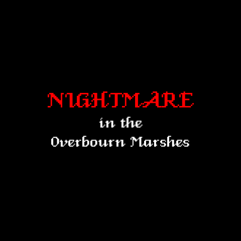
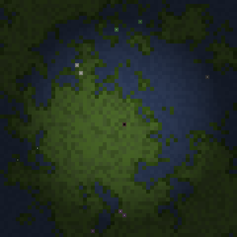

# NIGHTMARE in the Overbourn Marshes

## About
_NIGHTMARE in the Overbourn Marshes_ is a small game I made in 2009 to experiment with [SDL](https://www.libsdl.org/) and procedural content generation ([PCG](http://pcg.wikidot.com/)).

In particular, I was interested in a 2D map-generation algorithm described by Chevy Ray Johnston – the post is no longer available, but it was archived [here](http://web.archive.org/web/20110809084421/http://properundead.com/2009/03/cave-generator.html).

In the game, the player moves through a randomly-generated marsh, observes the environment, and answers a small riddle about the objects within – how many, whether they are submerged, and an odd-one-out. Once they've answered three such riddles, the game ends.

I've tried to standardise and streamline most of the code for sharing publicly, with apologies for any oversights.

What follows is the (mostly) original text that went along with the game's initial 2009 release.

 

## Introduction
The goal of the NIGHTMARE game series is to investigate environmental exploration as a game mechanic. The games use procedural content generation to provide an infinite number of landscapes to discover.

_NIGHTMARE in the Overbourn Marshes_, the first of the series, is an extremely simple adventure-style game. Explore the gloomy marshes and answer riddles about the various landmarks therein.

More on the series and on the game itself can be found [here](http://www.newton64.ca/blog/?p=385) [Dead link].

## Installation
_NIGHTMARE in the Overbourn Marshes_ makes use of the [Simple Directmedia Layer library](http://www.libsdl.org) (SDL). As such, it is cross-platform and can be run on Linux, macOS, and Windows systems – if a particular version is unavailable, it is not forgotten, and will be made available ASAP.

To install, simply unzip the file containing this README and all game files to the directory of your choice.

To run, execute the appropriate `Overbourn` binary.

NOTE: Keep all directory structures intact, so that the game can access all required libraries and/or game assets.

## Controls
* Arrow keys : Move your character.
* L: Look in a particular direction. Depending on the target, you may be prompted to hit another key: arrows to specify a direction, or another key to answer a riddle (these will be specified). 
* Space / Return: Advance dialogue. If a riddle is being asked to which you do not know the answer, you can use this to back out of the dialogue instead of simply guessing.
* Esc: Quit the game at any time.

## Notes
On the [name](http://www.tuckborough.net/marshes.html#Overbourn%20Marshes):
> The Overbourn Marshes were in the Southfarthing south of the River Shirebourn where it flowed into the Brandywine River.
> Names & Etymology:
> A bourn is a small stream or brook. The Overbourn Marshes may have been so named because they were across the Shirebourn from the most populous part of the Eastfarthing. Or the first element may come from the Old English "ofer" meaning "border, riverbank."
> Source:
> The Fellowship of the Ring: Map of "A Part of the Shire" The Lord of the Rings: A Reader's Companion by Wayne G. Hammond and Christina Scull: "The Maps of The Lord of the Rings," p. lviii 

## Acknowledgments
* Chevy Ray Johnston, for the aforementioned algorithm, archived [here](http://web.archive.org/web/20110809084421/http://properundead.com/2009/03/cave-generator.html).
* Colour palettes inspired by [ColourLovers.com](http://www.colourlovers.com/).
* Audio sampled from the following users on [Freesound](http://www.freesound.org):
  * inchadney (Bells)
  * Dynamicell (Wind)
  * Dobroide (Insects)

## Links
* The original version of the game is available on [itch.io](https://nicknicknicknick.itch.io/overbourn).
* The [TIGSource thread](https://forums.tigsource.com/index.php?topic=13403.0).

## History
* v1.0 (5 July 2009)
  * First major release
  * Pretty much playable
* v1.1 (8 June 2020)
  * Public release
